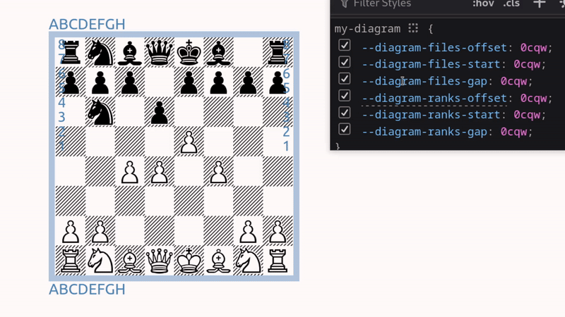

# HTML Diagram

Demo: https://dragunovartem99.github.io/html-diagram

```html
<html-diagram>
    Render chess diagrams with plain text – a lightweight Web Component
</html-diagram>
```


## Features

- Perfect for printing on paper
- Allows creation of old-school and unique-looking diagrams
- Scales infinitely without quality loss (as it doesn't rely on image formats)
- Zero dependencies
- Lightweight: the modules (CommonJS and ES) are each around `~5kb`
- Friendly to your CPU. Actually, it's just three `<div>` elements and 64 characters

## Note About Fonts

Full list of Fonts and their Authors: [List of Supported Fonts](#list-of-supported-fonts)

> [!IMPORTANT]
> All fonts in the demo are marked as **Freeware**.  
> However, it is strongly recommended to review the README file of any font you intend to use.

The **HTML Diagram** itself does not include any fonts, as you can check in the [npm package files](https://www.npmjs.com/package/html-diagram?activeTab=code) of the `html-diagram` package.

However, to ensure proper display, users needs to pick some chess font for rendering a diagram. For this demo, I've used **Freeware** fonts from the wonderful [Nørresundby Chess Club](https://www.enpassant.dk/chess/fonteng.htm).

All fonts used in the demo are located in [./public/fonts](https://github.com/dragunovartem99/html-diagram/tree/main/public/fonts) directory. Each subdirectory follows this structure:

```
📂 Diagram<font-name>
├── 📄 Diagram<font-name>.woff2
├── 📄 ORIGINAL_FONT.ttf
└── 📄 ORIGINAL_README.txt (if available)
```

### woff2 versions

To achieve minimum file size and consistency, each original font is accompanied by a `woff2` version. The `woff2` files reuse the following glyphs: king, queen, rook, bishop, knight, pawn, and empty square.

No modifications have been made to the design of the original glyphs.

> The `woff2` versions were created with FontForge, using encoding ISO 8859-5 (Cyrillic)

## Basic Usage

### 1. Installation

```shell
npm install html-diagram
```

### 2. JavaScript

Import the `HTMLDiagram` class; then use it to create custom HTML element:

```js
import { HTMLDiagram } from "html-diagram";
customElements.define("my-diagram", HTMLDiagram);
```

[Learn more about "customElements" on MDN](https://developer.mozilla.org/en-US/docs/Web/API/Web_components/Using_custom_elements)

### 3. CSS

Pick the chess font you like; then define it in CSS.

After you've read [note about fonts](#note-about-fonts), you can look in [./public/fonts](https://github.com/dragunovartem99/html-diagram/tree/main/public/fonts) directory, and pick something you like.

In this example, we'll use the lovely "Adventurer" font by chess fonts _champion_ - Armando H. Marroquin:

```css
@font-face {
    font-family: "Diagram Adventurer";
    src: "<your-path>/DiagramAdventurer.woff2";
}
```

Then, you must tell your diagram to use this font. This is achieved by using CSS variable:

```css
my-diagram {
    --diagram-font: "Diagram Adventurer";
}
```

### 4. HTML

Use element on your page

```html
<!-- empty board -->
<my-diagram></my-diagram>
```

## Attributes

This component is attribute-driven. You can use `html-diagram` element by creating HTML pages with in-place attribute values (pure static HTML / SSR), or update it dynamically - [Interacting With JavaScript](#interacting-with-javascript)

### `fen` attribute

[Forsyth–Edwards Notation.](https://en.wikipedia.org/wiki/Forsyth%E2%80%93Edwards_Notation) The most widespread approach for describing chess positions in modern software. You can provide full FEN record:

```html
<!-- starting positiion -->

<my-diagram fen="rnbqkbnr/pppppppp/8/8/8/8/PPPPPPPP/RNBQKBNR w KQkq - 0 1"></my-diagram>
```

Or, just a first field, piece placement data:

```html
<!-- starting positiion, using only piece placement data -->

<my-diagram fen="rnbqkbnr/pppppppp/8/8/8/8/PPPPPPPP/RNBQKBNR"></my-diagram>
```

### `flipped` attribute

Boolean attribute, that allows show the rotate the board to Black player's perspective

```html
<!-- starting positiion, from Black's point of view -->

<my-diagram flipped fen="..."></my-diagram>
```

> [!Warning]
> The only valid values are:
> ```
> flipped
> flipped=""
> flipped="flipped" (case-insensitive)
> ```
> Why: https://html.spec.whatwg.org/dev/common-microsyntaxes.html#boolean-attributes

### coords attribute

You can include list of board sides that you want to add a coordinates. The valid values are:

- `top`
- `bottom`
- `left`
- `right`

```html
<!-- starting positiion, file letters on the bottom, rank numbers on the right -->

<my-diagram coords="bottom right" fen="..."></my-diagram>
```

(the order and capitalization don't matter)


### Combining Attributes

You can use all attributes in single diagram:

```html
<my-diagram
    flipped
    coords="top right left bottom"
    fen="..."
>
</my-diagram>
```

### Interacting with Javascript

You can update diagram attributes by using [Element interface](https://developer.mozilla.org/en-US/docs/Web/API/Element) from standard [HTML DOM API](https://developer.mozilla.org/en-US/docs/Web/API/HTML_DOM_API):

```javascript
const myDiagram = document.querySelector("my-diagram");

myDiagram.setAttribute("fen", "rnbqkbnr/pppppppp/8/8/8/8/PPPPPPPP/RNBQKBNR w KQkq - 0 1");
myDiagram.setAttribute("flipped", "flipped");
myDiagram.setAttribute("coords", "bottom left");

// to remove flipped state

myDiagram.removeAttribute("flipped");
```

- [setAttribute() method](https://developer.mozilla.org/en-US/docs/Web/API/Element/setAttribute)
- [removeAttribute() method](https://developer.mozilla.org/en-US/docs/Web/API/Element/removeAttribute)

## Styling Options

```css
/* Diagram */

--diagram-font: "Your fiagram font";
--diagram-color: "Color of diagram font";
--diagram-border: "Border around chessboard";
--diagram-spacing

--diagram-coords-font
--diagram-coords-color
--diagram-coords-capitalize: "Text-transform for coordinates";
--diagram-coords-size

--diagram-files-offset
--diagram-files-start
--diagram-files-gap
--diagram-files-size

--diagram-ranks-offset
--diagram-ranks-start
--diagram-ranks-gap
--diagram-ranks-size
```

### Example of styling

First, let's add the basic styling:

```css
my-diagram {
	--diagram-font: "Diagram Smart";
	--diagram-color: #000;
	--diagram-border: 12px lightsteelblue solid;
}
```


<hr>

Then, add [`coords` attribute](#coords-attribute) and give basic theme for coordinates:

```css
my-diagram {
	--diagram-coords-font: "Ubuntu";
	--diagram-coords-color: steelblue;
	--diagram-coords-capitalize: uppercase;
	--diagram-coords-size: 6cqw;
}
```


<hr>

The coordinates need some positioning:



```css
my-diagram {
	--diagram-files-offset: 1cqw;
	--diagram-files-start: 6.8cqw;
	--diagram-files-gap: 8cqw;
	--diagram-ranks-offset: 9cqw;
	--diagram-ranks-start: 3cqw;
	--diagram-ranks-gap: 6.5cqw;
}
```

Astonishing final result:


## List of Supported Fonts

[Note About Fonts](#note-about-fonts)
A big thank you to all the people and companies who created these amazing fonts:

| Font       | Author               | Year |
| ---------- | -------------------- | ---- |
| Adventurer | Armando H. Marroquin | 2000 |
| Kingdom    | Armando H. Marroquin | 1998 |
| Leipzig    | Armando H. Marroquin | 1998 |
| Smart      | Christoph Wirth      | 1992 |
| Tasc       | Tasc B.V.            | 1995 |

If you know of any more **Freeware** chess fonts, or if you've created your own, feel free to let me know!
