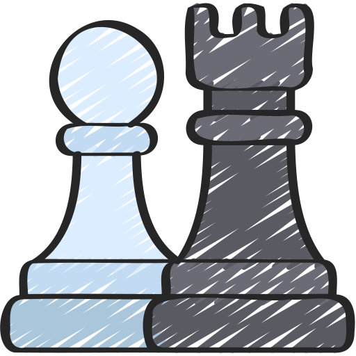

#  HTML Diagram


<a href="https://dragunovartem99.github.io/html-diagram" target="_blank"></a>


```html
<html-diagram>
    Create chessboards with just text – a lightweight Web Component
</html-diagram>
```


## Features

- Perfect for printing on paper
- Allows creation of old-school and unique-looking diagrams
- Scales infinitely without quality loss (as it doesn't rely on image formats)
- Zero dependencies
- Lightweight: the modules (ES and CommonJS) are each around `~5kb`
- Friendly to your CPU

> Supported browsers: Chrome 105+, Safari 16.4+, Firefox 110+

## Note About Fonts

[List Of Supported Fonts](#list-of-supported-fonts)

> [!Warning]
> All fonts used in the demo are marked as **Freeware** by their respective authors.  
> However, it is strongly recommended to review the README file of any font you intend to use.

The **HTML Diagram** itself does not include any fonts, as you can verify in the [npm package files](https://www.npmjs.com/package/html-diagram?activeTab=code) of the `html-diagram` package.

To display chess positions, users need to select a chess font for rendering diagrams. For this demo, I have used Freeware fonts generously provided by the [Nørresundby Chess Club](https://www.enpassant.dk/chess/fonteng.htm). Special thanks to them for making these fonts publicly available.

All fonts used in the demo are located in [./public/fonts](https://github.com/dragunovartem99/html-diagram/tree/main/public/fonts) directory. Each subdirectory follows this structure:

```
📂 Diagram<name>
├── 📄 Diagram<name>.woff2
├── 📄 ORIGINAL_FONT
└── 📄 ORIGINAL_README (if available)
```

### woff2 versions

To achieve compatibility and minimize file size, each original font is accompanied by a  `woff2` version. The `woff2` files reuse the following glyphs: king, queen, rook, bishop, knight, pawn, and empty square.

No modifications have been made to the design of the original glyphs.

> The `woff2` versions were created with FontForge, using encoding ISO 8859-5 (Cyrillic)

## Basic Usage

### 1. Installation

```bash
npm install html-diagram
```

### 2. JavaScript

Import the `HTMLDiagram` class; then use it to create custom HTML element:

```javascript
import { HTMLDiagram } from "html-diagram";
customElements.define("my-diagram", HTMLDiagram);
```

[Learn more about "customElements" on MDN](https://developer.mozilla.org/en-US/docs/Web/API/Web_components/Using_custom_elements)

### 3. CSS

Pick the chess font you like; then define it in CSS.

After you've read [note about fonts](#note-about-fonts), you can look in [./public/fonts](https://github.com/dragunovartem99/html-diagram/tree/main/public/fonts) directory, and pick something you like.

In this example, we'll use the lovely "Adventurer" font by chess fonts _legend_ - Armando H. Marroquin:

```css
@font-face {
    font-family: "Diagram Adventurer";
    src: "<your-path>/DiagramAdventurer.woff2";
}
```

Then, you must tell your diagram to use this font. This is achieved by using CSS variable:

```css
my-diagram {
    --diagram-font: "Diagram Adventurer";
}
```

### 4. HTML

Use element on your page

```html
<!-- empty board -->

<my-diagram></my-diagram>
```

## Attributes

This component is attribute-driven. You can use `html-diagram` element by creating HTML pages with in-place attribute values (pure static HTML / SSR), or update it dynamically - [Interacting With JavaScript](#interacting-with-javascript)

### `fen` attribute

[Forsyth–Edwards Notation.](https://en.wikipedia.org/wiki/Forsyth%E2%80%93Edwards_Notation) The most widespread approach for describing chess positions in modern software. You can provide full FEN record:

```html
<!-- starting position -->

<my-diagram fen="rnbqkbnr/pppppppp/8/8/8/8/PPPPPPPP/RNBQKBNR w KQkq - 0 1"></my-diagram>
```

Or, just a first field, piece placement data:

```html
<!-- starting position, using only piece placement data -->

<my-diagram fen="rnbqkbnr/pppppppp/8/8/8/8/PPPPPPPP/RNBQKBNR"></my-diagram>
```

### `flipped` attribute

Boolean attribute that rotates the board to show the perspective of the Black player.

```html
<!-- Black's point of view -->

<my-diagram flipped></my-diagram>

<!-- or -->
<my-diagram flipped=""></my-diagram>
<my-diagram flipped="flipped"></my-diagram>
```

### `colored` attribute

Boolean attribute that enables a colored mode for the diagram.

```html
<!-- colored mode enabled-->

<my-diagram colored></my-diagram>

<!-- or -->
<my-diagram colored=""></my-diagram>
<my-diagram colored="colored"></my-diagram>
```

### Combining Attributes

You can combine multiple attributes in a single html-diagram element to customize its behavior and appearance.

```html
<my-diagram
	fen="rnbqkbnr/pppppppp/8/8/8/8/PPPPPPPP/RNBQKBNR w KQkq - 0 1"
	flipped
	colored
></my-diagram>
```

### Interacting with Javascript

You can update diagram attributes by using [Element interface](https://developer.mozilla.org/en-US/docs/Web/API/Element) from standard [HTML DOM API](https://developer.mozilla.org/en-US/docs/Web/API/HTML_DOM_API):

```javascript
const myDiagram = document.querySelector("my-diagram");

myDiagram.setAttribute("fen", "rnbqkbnr/pppppppp/8/8/8/8/PPPPPPPP/RNBQKBNR w KQkq - 0 1");
myDiagram.setAttribute("flipped", "flipped");
myDiagram.setAttribute("colored", "colored");

myDiagram.removeAttribute("flipped"); // remove the flipped state
```

## Styling

Universal Settings:
- `--diagram-font`: Font family for chess pieces
- `--diagram-stroke`: Stroke color for pieces and board

Colored Mode:
- `--diagram-fill`: Fill color inside chess pieces
- `--diagram-light`: Color of light squares
- `--diagram-dark`: Color of dark squares
- `--diagram-outline`: Outline around chess pieces. Use `cqw` units

> [!Note]
> `1cqw` is equal to 1% of the diagram's width. This ensures the diagram remains responsive and proportional.  
> [MDN: Container query length units](https://developer.mozilla.org/en-US/docs/Web/CSS/CSS_containment/Container_queries#container_query_length_units)

## List of Supported Fonts

[Note About Fonts](#note-about-fonts)

A heartfelt thank you to the creators and contributors of these exceptional **Freeware** fonts:

| Font Name  | Author               | Year |
| ---------- | -------------------- | ---- |
| Adventurer | Armando H. Marroquin | 2000 |
| Berlin     | Eric Bentzen         | 1997 |
| Cases      | Matthieu Leschemelle | 1999 |
| Merida     | Armando H. Marroquin | 1998 |
| Smart      | Christoph Wirth      | 1992 |

If you know of any additional **free** (or **Freeware**) chess fonts, or if you’ve created your own, please feel free to share them with me!
